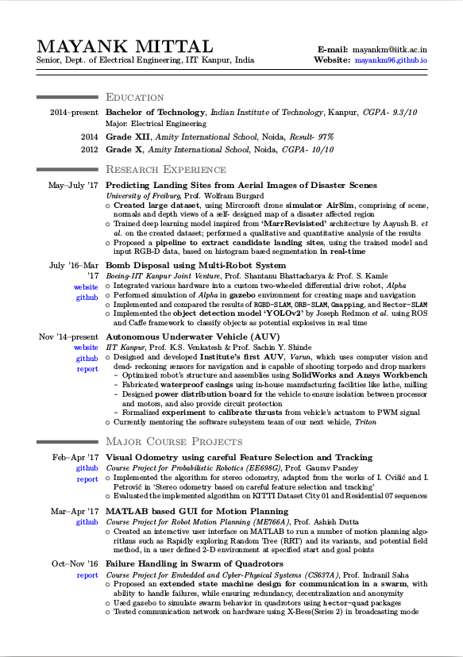
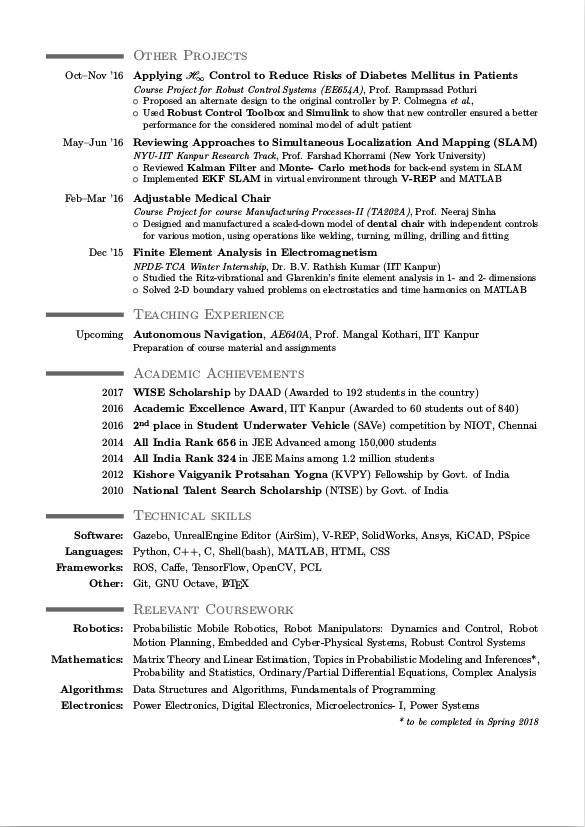

## How to Use

### Requirements

A full TeX distribution is required. To install TeX Live:
```
sudo apt-get install texlive-full
```

### Usage

To compile the  [`cv.tex`](cv.tex) file, run:
```
xelatex cv.tex
```

This should result in the creation of [`cv.pdf`](cv.pdf)

## Preview

To view [PDF](cv.pdf)

| Page. 1 | Page. 2 |
|:---:|:---:|
| [](cv.pdf)  | [](cv.pdf) |

## Credits

[Latex](http://www.latex-project.org/) is a fantastic typesetting program that a lot of people use these days, especially the math and computer science people in academia.

The [moderncv theme](https://github.com/xdanaux/moderncv) for my resume is contributed by Xavier Danaux and can be downloaded [here](http://tug.ctan.org/tex-archive/macros/latex/contrib/moderncv/).

## Copyright

Feel free to use and modify the `.tex` files. However, do not distribute the content of the resume for any purpose without my permission.
